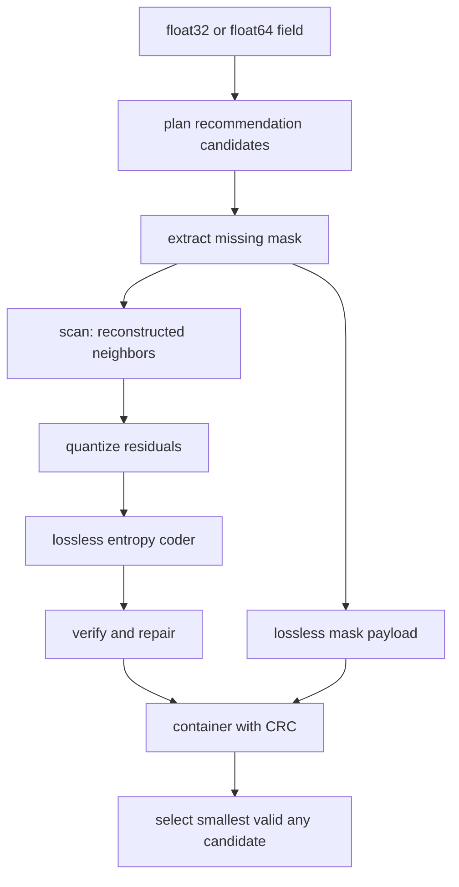

# BRACE Architecture

The codec is a deterministic, error-bounded `numcodecs.Codec` for gridded
`float32` and `float64` data. It accepts two-dimensional `(latitude, longitude)`
fields and three-dimensional `(time, latitude, longitude)` fields; two-dimensional
inputs are normalized internally to one time slice. It uses a
reconstructed-neighbor spatial-temporal predictor and a lossless entropy coder;
it has no runtime model or external model weights.

## Pipeline

The scan visits `(time, latitude, longitude)` in a fixed order. Each valid
cell is predicted from already reconstructed left, top, diagonal, and
temporal-parent cells. The longitude-local stencil is `(left 8, top 2,
top-left 1, top-right 1, temporal 1)`. A reconstructed value of exactly zero
is treated as unavailable for the left, top, and temporal neighbors. At a cold
start the predictor uses a constant value of `32.0`, which is available
identically to encode and decode.

The encoder simulates the decoder state while quantizing. Decode repeats the
same walk and therefore obtains the same prediction for every symbol. Rust
and Python implementations of the scan are kept bit-exact. The codec does
not expose a runtime switch for acceleration: if the compiled `brace_scan`
extension is importable, encode and decode automatically select the Rust
function matching the configured dtype (`float32` or `float64`). Python is the
fallback when the extension, or the required dtype-specific symbol, is
unavailable.

## Guarantees

The quantization step is `2 * max(error_bound, eps(dtype))`. The predictor is
run identically by the encoder and decoder, so prediction error cancels and the
quantization error consumes the configured absolute-error budget. The verifier
reconstructs the decoder result and emits exact repairs for any outlier before
the container is returned. Missing values are never predicted or quantized:
their RLE-or-bitpacked mask is stored separately and the configured sentinel is
restored exactly. Non-finite input values are always classified as missing.

Relative mode uses the same scan and entropy stages over log magnitudes. It
stores zero and sign masks alongside the missing mask and verifies the
pointwise condition `abs(decoded - original) <= error_bound * abs(original)`
for every nonzero valid value. Absolute mode remains the default.

Recommendation-created codecs retain a canonical requirement tree. `all`
branches activate all children; `any` branches are expanded into complete
candidates. Each candidate is encoded and checked against its full nested
diagnostics. Failing candidates are discarded and the smallest valid container
is returned. The selected branch and strategy remain in the winning header.

Mean requirements use aggregate budgets with exact repairs. Pointwise children
inside `all` remain active. Quadratic policies can provide a deterministic
256-element local step table, while lossless plans use a byte-shuffled typed
payload before optional Zstandard compression.

The encoded header records the normalized shape, dtype, missing-value policy,
requested and effective error bounds, quantization step, origin, valid and
repaired counts, codec version, and payload/error metrics. `BraceCodec.get_config()`
also exposes the public codec id, shape, bound, missing value, dtype, and
outer-compression setting; the configuration is JSON serializable and can be
restored with `BraceCodec.from_config()`.

Recommendation headers include `recommendation_schema_version`, source
recommendation version, marker query, complete requirements, selected tree,
strategy, and `recommendation_checks`. Decode validates schema and strategy
compatibility, mask partition lengths, entropy lengths/trailing bytes, and
repair index ranges before scanning.

## Components

- `codec.py`: public API and encode/decode orchestration.
- `mask.py`: missing-value extraction and compact mask coding.
- `quant.py`: bound-derived residual lattice.
- `model/entropy.py`: lossless symbol coding.
- `verify.py`: post-encode bound verification and repair.
- `recommendations.py`: typed recommendation adapter, canonical plan tree, and
  candidate branch expansion.
- `container.py`: BRCE v3 framing, per-payload optional outer compression, and CRC.
- `rust/brace_scan/src/scan.rs`: optional reconstructed-neighbor scan for
  float32 and float64, selected automatically when its compiled extension is
  importable.
- `rust/brace_scan/src/rans.rs`: optional static RANGE and context-adaptive
  CTX rANS codecs, selected automatically by the entropy module.
- `rust/brace_scan/src/lib.rs`: Python extension entry point that registers
  the scan and entropy bindings.

## Runtime behavior

Rust acceleration is optional and selected automatically per dtype. The
extension provides float32 and float64 causal scan bindings plus static and
context-adaptive rANS bindings. The Python implementations remain the
reference fallback, and the encoded format is unchanged when Rust is absent.

Each encode and decode records stage timings in `codec.last_timings`. Encode
timings cover mask extraction, scan, verification, entropy coding, container
framing, and the total; decode timings cover container parsing, mask unpacking,
entropy decoding, scan, missing-value restoration, and the total.
