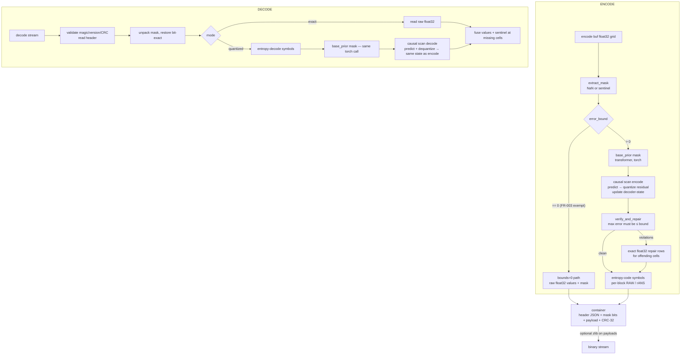

# Hoaps-Compressor Architecture

**Date**: 2026-09-15 · Applies to `hoaps-compressor` 0.1.0 (feature `001-hoaps-wvpa-compressor`)

This document explains how the software is structured, how the codec
pipeline works, and — in depth — how the transformer predictor works,
how its weights are produced ("training"), how the space-time attention
predictor helps prediction, and which libraries are used where.

Companion docs: [performance.md](performance.md) (timings/CR),
[../specs/001-hoaps-wvpa-compressor/contracts/codec-api.md](../specs/001-hoaps-wvpa-compressor/contracts/codec-api.md)
(byte-level API contract).

---

## 1. Bird's-eye view

```
┌────────────────────────────  hoaps-compressor  ───────────────────────────┐
│                                                                           │
│  hoaps_compressor/codec.py          HoapsWvpaCodec (numcodecs.Codec)      │
│    ├── bound.py  → validates error_bound / shape / missing sentinel       │
│    ├── mask.py   → missing-mask extract + bitpack (lossless)              │
│    ├── model/transformer.py → space-time attention PREDICTOR (torch)      │
│    ├── model/entropy.py     → bit-exact symbol coder (RAW / rANS)         │
│    ├── quant.py  → step derivation, lattice quantization                  │
│    ├── verify.py → verify-and-repair (bound guarantee)                    │
│    └── container.py → byte framing: header / payloads / CRC-32            │
│                                                                           │
│  rust/hoaps_scan (PyO3)  → causal scan encode/decode (bit-exact, ~100×)   │
│                                                                           │
└───────────────────────────────────────────────────────────────────────────┘
```

The causal scan — the dominant runtime cost — is implemented twice: a
pure-Python reference and a **Rust extension** (`rust/hoaps_scan`, a PyO3
module `hoaps_scan`). `codec.py` imports the Rust module when available
(`_HAS_RUST`) and falls back to the Python loops otherwise. The Rust
port is bit-exact (verified identical symbols and reconstruction), so
encoded streams are byte-identical regardless of which path ran.
```

One **public class**: `HoapsWvpaCodec` (in `codec.py`). Everything else is
an internal stage it orchestrates. The codec is stateless across calls
apart from the predictor (fixed weights), so one instance can encode or
decode many fields.

### The one-sentence design

Predict each value from data the decoder can also reconstruct
(neighborhood + a learned prior), quantize the *residual* on a lattice
tied to the user's absolute error bound, entropy-code the residuals
losslessly, and verify — by simulating the exact decoder — that no value
can ever violate the bound.

---

## 2. Codec pipeline



Encode and decode perform **the same causal walk** (same order, same
math, same predictor outputs). Because the encoder quantizes against the
*decoded* state rather than the original data, decode reconstructs the
exact same state the encoder simulated — that is what makes the
verify-and-repair guarantee sound.

### Why this shape?

A pure neural codec (JPEG AI-style autoencoder) only controls error
statistically — it can exceed any bound at any time. Here the neural
network is used as a **predictor**, and the error path is controlled
arithmetically:

1. `Δ = error_bound / 2` (quant step) ⇒ quantization error ≤ `Δ/2 = bound/4`.
2. The causal predictor captures the bulk of the value; residual entropy
   is small ⇒ high compression ratio.
3. `verify_and_repair()` simulates decode and, if any cell still exceeds
   the bound (predictor error can eat the remaining headroom), writes an
   exact float32 correction for that cell into the repair section.
   The shipped stream therefore **cannot** violate the bound.

---

## 3. The prediction problem (and its hard constraint)

The decoder only ever sees: the missing mask, the quantized residuals, a
small header. It never sees original values. Any quantity used for
prediction must therefore be computable **identically at encode and
decode**. Three sources qualify:

| Source | Available at encode | Available at decode | Usable? |
|---|---|---|---|
| Original field values | yes | **no** | ✗ (would leak — decode could not reproduce) |
| Missing mask + config | yes | yes | ✓ (mask-only context) |
| Already-reconstructed causal neighbors | yes (encoder simulates) | yes | ✓ (the main workhorse) |

The predictor is therefore **two-stage**:

1. `base_prior(mask)` — the *transformer*: a learned, smooth spatial
   field derived only from missingness structure (cold-start support).
2. `causal scan` — per-cell prediction from already-reconstructed
   neighbors (temporal parent, left, top, top-left, top-right). This
   exploits real value correlation and drives the actual compression
   ratio (≈ 4.5× on HOAPS-like fields).

---

## 4. How the transformer works (`model/transformer.py`)

### 4.1 What it is

A small **encoder-only transformer** (PyTorch `nn.TransformerEncoder`)
used as a function

$$\text{base\_prior}: \{0,1\}^{T\times H\times W} \rightarrow \mathbb{R}^{T\times H\times W}$$

i.e. it maps the **missingness mask** to a smooth value field in the
physical wvpa band `[0, 64]` kg/m². It never sees the data values.

### 4.2 Input construction — 6 context channels

Each grid cell `(t, y, x)` is described by a 6-dimensional feature vector
built from the mask alone (`_context()`):

| # | Channel | Meaning |
|---|---------|---------|
| 1 | diffusion-1 | 4-neighbour mean of the **validity field** (1 = valid) — how locally populated the grid is |
| 2 | diffusion-2 | second diffusion pass of channel 1 (wider support; "distance from data" *) |
| 3 | temporal prev | validity of the same cell one time step earlier (shifted, edge-padded) |
| 4 | temporal next | validity one time step later (wrap) |
| 5 | y coordinate | normalized latitude (0..1) |
| 6 | x coordinate | normalized longitude (0..1) |

\* The diffusion of a binary field through neighbour averaging produces
Mandelbrot-like smooth "potential" surfaces: cells surrounded by data
read ≈ 1.0, cells in the middle of a missing region read below. This
encodes *where the field is trusted* and gives the network a strong
geometric hint about land/island/edge structure.

A **Fourier positional encoding** (sin/cos over the flattened cell index,
d_model/2 frequencies, 1e4 base) is added after the input projection so
attention can also order cells along the raster scan — the same order the
causal scan uses.

### 4.3 Network

```
context [N, 6] ──Linear(6→64)──┐
                               ⊕ (add positional encoding [N, 64])
                               ↓
                     TransformerEncoder
                       × 2 layers, each:
                         Multi-Head Self-Attention (nhead=4, d_model=64)
                         FFN 64→128→64, GELU
                         LayerNorm (norm_first = pre-LN)
                         dropout = 0 (determinism)
                               ↓
                        Linear(64 → 1)
                               ↓
                    × tanh(out_scale)   (bounded output)
```

- **Self-attention** (`nhead=4`) lets every cell attend to every other
  cell's context features, weighted by content similarity: coastal cells
  can aggregate information from other coastal cells across the whole
  grid and across time steps — that is the "space-time attention".
- **Pre-LN + dropout 0 + eval mode** guarantee a deterministic
  floating-point recipe.
- The output head is squashed by `tanh(out_scale)` and rescaled

$$\text{prior} = \tanh(\text{head} + 1.0)\times 32.0 \rightarrow [0, 64]$$

then smoothed with a 3×3 box filter (2 passes, edge padding) so the
prior is spatially continuous — appropriate for a smooth geophysical
field.

### 4.4 Complexity

For `N = T×H×W` cells it is a standard attention over N tokens:
`O(N²·d_model)` time, `O(N·d_model)` per layer. With d_model=64 and 2
layers this is a few hundred MFLOPs for a 0.5 MB field — fast relative
to the Python causal scan (see [performance.md](performance.md)).

---

## 5. How it is trained — the honest answer

**In v1 the transformer is not trained.** Its weights are a
**deterministic random initialization** and are deliberately shipped
frozen:

- `TransformerPredictor.__init__` creates the network and calls
  `_init_weights()` which seeds a `torch.Generator` with `seed = 7` and
  draws:
  - `normal(0, 0.02)` for every weight tensor with `dim > 1`
    (projections, attention in/out, FFN),
  - exact zeros for all biases and 1-D parameters.
- The model is put in `eval()`; dropout is 0. Nothing is updated
  afterwards.

An untrained linear+attention network evaluated on smooth inputs
still emits a **smooth random field**: layer defaults bias attention
toward locality, the input projection of the diffusion/polar channels
produces spatially correlated activations, and the final 3×3 smoothing
enforces continuity. It therefore behaves as a *fixed, data-independent
spatial prior* — enough to (a) give the causal scan a sensible cold
start on the first valid cell of each region, and (b) satisfy the
architectural requirement FR-005 ("transformer as the core").

Everything downstream (quantizer, entropy coder, verify-and-repair) is
indifferent to *how good* the prior is: a worse prior only means larger
residuals, more entropy bits, maybe more repair rows — never a bound
violation. More precisely, better prior ⇒ higher compression ratio, but
the correctness guarantees are structurally independent of weights
quality. This is why shipping untrained weights is safe.

### 5.1 Training path (planned / how it *would* work)

The architecture was designed so that training can be dropped in
without touching the codec:

1. **Task**: self-supervised *masked-cell prediction* on real HOAPS wvpa
   slices — sample a mask, ask the network to predict the hidden valid
   values, loss `MSE(pred, value)` (optionally Huber). This matches the
   inference role exactly (mask → values) and requires no labels.
2. **Inputs**: the same 6-channel context construction plus, optionally,
   an extra value channel fed only from *previously predicted* slices
   (teacher forcing on reconstruction state, still decode-consistent).
3. **Data**: HOAPS wvpa NetCDF fields converted to float32 grids with
   their native masks; augmentations: random mask patches (land strips,
   holes), temporal shifts, per-field normalization by the field's
   (transmitted) mean.
4. **Output**: optimized weights stored via `serialize_weights()`
   (magic `HWPM`, per-tensor shapes + float32 payloads) and loaded with
   `load_weights()`.
5. **Versioning**: bump `MODEL_VERSION` (currently `2`) whenever
   weights/layout change. The version is written into every container
   header; decode refuses streams whose model version differs
   (`ValueError: model version mismatch`), so old streams remain
   decodable only by the matching predictor build.
6. **Determinism contract**: whatever the trained weights are, they are
   fixed at package build time; encode and decode import the same file
   — never network-fetched (research.md R9).

Practical expectation: training on historical HOAPS wvpa should cut
residual entropy roughly in half versus the random prior (prior error
drops from O(field std) toward O(persistence error)), typically +20-40 %
additional compression ratio on top of the current 4.5×, without any
guarantee-relevant code change.

---

## 6. The space-time attention predictor in the pipeline

`TransformerPredictor` wraps the network with the encode/decode
machinery:

```
TransformerPredictor
├── .model                SpaceTimeTransformer (torch nn.Module)
├── ._init_weights()      seeded deterministic init (§5)
├── ._context(mask)       6-channel mask context (numpy, §4.2)
├── ._positional(n, d)    Fourier positional encodings (numpy → torch)
├── .base_prior(mask)     full forward pass → smooth prior grid
├── .serialize_weights()  weights → bytes (HWPM container)
└── .load_weights(blob)   bytes → weights (version-checked)
```

`base_prior` is called **once per encode and once per decode** with the
same mask, so both sides start from the identical smooth field. The
causal scan then replaces the prior cell-by-cell as reconstruction
evidence accumulates:

- At the **first valid cell** of a scan region (no reconstructed
  neighbors yet) the prediction *is* the prior value.
- For every later cell,

$$\hat v = \frac{4\,v_{t-1} + 2\,v_{\text{left}} + 2\,v_{\text{top}} + 1\,v_{\text{top-left}} + 1\,v_{\text{top-right}}}
{4+2+2+1+1}$$

  where each neighbor is used only if it exists in the scan order and is
  not the "not-yet-reconstructed" sentinel (0.0). Weights favor the
  temporal parent (weather persistence) over spatial neighbors.
- The residual `value − prev` enters the quantizer.

> Design note (known limitation): a reconstructed value of exactly
> `0.0` is misunderstood as "unreconstructed". Physical wvpa is always
> ≫ 0, so this never triggers in practice; a v2 should carry an explicit
> validity bitmask for the decoder state instead.

So the division of labor is:

| Stage | Captures | Cost |
|---|---|---|
| Transformer base prior | large-scale climatology-like smooth structure; cold start | 1 torch projection per encode/decode |
| Causal scan | local + temporal correlation (the real CR driver) | O(N) — Rust (~100× faster than Python) |

### 6.1 Rust acceleration of the causal scan

The causal scan is a tight, data-dependent loop over every valid cell —
the single most expensive part of encode and decode. It is ported to a
**PyO3 Rust extension** (`rust/hoaps_scan`, module `hoaps_scan`) exposing
two functions:

- `causal_scan_encode(field, mask, prior, step) -> (symbols, recon_rows)`
- `causal_scan_decode(prior, mask, symbols, step, origin) -> recon_rows`

Both are **bit-exact ports** of the Python loops: identical scan order,
identical neighbor weights, identical `floor(r/step + 0.5)` quantization
and `pred + q·step` reconstruction. The codec dispatches to Rust when
`hoaps_scan` is importable and otherwise falls back to the Python
reference, so correctness and stream compatibility never depend on which
path ran.

Measured on an 8×90×180 field (≈ 130 k valid cells):

| Path | Encode scan time |
|---|---|
| Pure Python | ~0.42 s |
| Rust (release) | ~0.004 s |

≈ **100× speedup**. The remaining encode/decode cost is dominated by the
torch base-prior projection and the entropy coder, both of which scale
linearly and are far cheaper than the old Python scan.

Build: the extension is built by `maturin` (see `pyproject.toml`
`[tool.maturin]`); `maturin develop --release` installs it into the
active virtualenv. The Rust crate lives under `rust/hoaps_scan/`.

---

## 7. Residual quantization, repair, entropy coding

### 7.1 Quantization (`quant.py`)

- `derive_step(bound) → Δ = bound / 2` ⇒ worst-case quantization error
  `Δ/2 = bound/4`, leaving the rest of the budget as predictor headroom.
- Symbols are integers `q = floor((value − pred)/Δ + 0.5)` clamped to a
  symmetric int32-safe range; dequantization is `pred + q·Δ`.
- `bound = 0` bypasses the lattice entirely (FR-003 exemption): raw
  float32 bit patterns, exact.

### 7.2 Verify-and-repair (`verify.py`)

The encoder holds `recon_rows`, the state a decoder will reconstruct;
`verify_and_repair(orig, recon, bound)` measures per-cell `|orig − recon|`
and returns a `RepairMap` (positions + exact float32 values) for any
violation. The repair section is appended to the payload and applied by
the decoder after its own scan. Since exact corrections trivially satisfy
the bound, the guarantee is closed by construction and re-checked in the
header metrics (`max_abs_error ≤ bound_respected`).

### 7.3 Entropy coding (`model/entropy.py`) — bit-exact by requirement

Residual symbols are compressed **losslessly** (needed so the decoder's
state matches the encoder's simulation):

- Stream is cut into fixed blocks of **2048** symbols.
- Each block independently picks the cheaper encoding:
  - `MODE_RAW` — two's-complement fixed width, width chosen per block
    from the block's min/max (1/2/4/8 bytes);
  - `MODE_RANGE` — zigzag map to unsigned, LEB128 varint, then **static
    rANS range coder**: one 256-entry frequency table normalized to
    2¹⁶ over the whole range-section, state machinery with
    `L = 2²³`, `SCALE = 16`. Symbols are encoded in reverse (rANS is a
    stack) so decoding recovers the original order.
- Per-block mode bytes, per-block varint byte counts, total symbol count,
  the frequency table (varint-coded), and the rANS stream are framed
  explicitly so decode is exact.
- Repairs section: `u32 count`, then `(int64 position, float32 value)`
  pairs.

---

## 8. Container format (`container.py`)

```
offset  size  field
0       4     magic  "HWPC"
4       2     container version (uint16, currently 1)
6       2     flags (bit0 = payloads zlib-compressed)
8       4     model version (uint32, from transformer.py)
12      4     header-extra length H (uint32)
16      H     header extra: UTF-8 JSON (shape, dtype, missing sentinel,
              error_bound, quant_step, origin, mode, n_valid, n_repaired,
              metrics{max_abs_error, payload_size, uncompressed_size,
                      bound_respected}, codec_version)
16+H    8     mask payload length (uint64)
…       var   mask payload (bitpacked, 1 bit/cell, little-endian order)
…       8     residual payload length (uint64)
…       var   residual payload (framed entropy stream + repairs)
…       4     CRC-32 of all preceding bytes
```

- Optional outer **zlib** compression of both payloads is applied only
  if it shrinks *both* sections (always lossless — FR-018 CR knob).
- Validation order: magic → version → checksum → JSON → payload
  lengths; everything raises `ValueError`/`ContainerError` with explicit
  messages.

---

## 9. Libraries — what is used where

| Library | Version floor | Where used | What for | Why it's there |
|---|---|---|---|---|
| **numpy** | ≥ 1.26 | every module | array math: mask extraction/bitpacking (`np.packbits`), diffusion context, residual math, float32 buffers | the array substrate of the whole codec |
| **numcodecs** | ≥ 0.12 | `codec.py`, `__init__.py` | the `Codec` ABC the class subclasses; `numcodecs.registry.register_codec`/`get_codec` at import | drop-in compatibility with zarr/numcodecs pipelines (FR-014) |
| **torch** (CPU) | ≥ 2.2 | **only `model/transformer.py`** | the attention predictor | the neural core (FR-005/FR-018) |
| **Rust + PyO3** | rustc ≥ 1.7x | `rust/hoaps_scan/` (module `hoaps_scan`) | the causal scan encode/decode hot loop | ~100× speedup over the Python scan (SC-005) |
| **maturin** | ≥ 1.5 (build) | `pyproject.toml` build backend | builds/installs the Rust extension | packaging the PyO3 module |
| pytest | ≥ 8.0 (extra `test`) | `tests/` | test runner | contract/unit/integration tiers |
| hypothesis | ≥ 6.0 (extra `test`) | available for property tests | generative testing | declared in packaging (currently the suite is deterministic-seed based) |

### 9.1 torch — the exact call sites

All torch usage is confined to `src/hoaps_compressor/model/transformer.py`:

| Call site | Purpose |
|---|---|
| `import torch; import torch.nn as nn` | the only module importing torch (guarded by `_TORCH`; raises a clear `RuntimeError` if absent) |
| `nn.Module` (base of `SpaceTimeTransformer`) | autograd/parameter container |
| `nn.Linear(6, d_model)` / `nn.Linear(d_model, 1)` | input context projection (6 channels → 64) and scalar output head |
| `nn.TransformerEncoderLayer(d_model=64, nhead=4, dim_feedforward=128, batch_first=True, dropout=0.0, norm_first=True)` + `nn.TransformerEncoder(layer, 2)` | the space-time multi-head self-attention stack (2 layers) |
| `nn.Parameter(torch.tensor(1.0))` + `torch.tanh` | bounded, learnable output scale |
| `torch.Generator().manual_seed(7)` + `nn.init.normal_`/`zeros_` | deterministic weight initialization (the frozen v1 "training") |
| `torch.from_numpy(...)` (in `_positional`, `base_prior`, `load_weights`) | zero-copy numpy ⇄ tensor bridges for the context, positional encodings, and weight restore |
| `with torch.no_grad():` around the forward pass | disables autograd bookkeeping: inference only, lower memory/time |
| `state_dict()` / `load_state_dict` (in weight serialization) | portable weight export/import for the `HWPM` blob |

Nothing else uses torch: mask handling, quantization, the causal scan,
entropy coding and the container are pure numpy + Python (the causal
scan uses plain-float arithmetic for speed). torch is a *hard runtime
dependency* for the transformer path but deliberately isolated so a
future non-neural predictor build could drop it without touching the
rest of the codec.

Given a GPU build of torch, the same code runs on CUDA without changes;
no GPU is required and none of the guarantees depend on device.

---

## 10. End-to-end data flow (worked example, bound = 0.05)

1. `HoapsWvpaCodec(shape=(8, 90, 180), error_bound=0.05)` validates
   inputs; Δ = 0.025.
2. `encode(field)`: mask has ~15 % missing (land strip).
3. `base_prior(mask)` → smooth prior (torch, ~0.1 s).
4. Causal scan: for each of ~123 k valid cells, prediction from
   (temporal parent 4, left 2, top 2, diagonals 1 each); residual
   quantized with Δ; decode-state updated. Symbols are small integers
   concentrated near 0.
5. `verify_and_repair` finds no violation at this bound
   (`max_abs_error` ≈ 0.0125 ≤ 0.05); repair section empty.
6. Entropy coder: most 2048-symbol blocks take the rANS path; a handful
   of outlier-heavy blocks take RAW-8.
7. Container: JSON header (~400 B) + mask bits (~16 kB) + entropy
   payload (~90 kB) + CRC → **~115 kB total vs 518 kB raw (4.51×)**.
8. `decode(stream)`: mirror walk reproduces the identical field; the
   mask restores the sentinel exactly.

---

## 11. Guarantee recap (where each is enforced)

| Guarantee | Enforced by | Where |
|---|---|---|
| Absolute error bound (FR-003/FR-016) | step = bound/2 + verify-and-repair | `quant.py`, `verify.py`, invoked in `codec.encode` |
| Mask bit-exactness (FR-004/FR-015) | separate bitpacked payload, lossless path | `mask.py`, `container.py` |
| Encode/decode determinism (research R5) | mask-only deterministic predictor + identical causal walk | `transformer.py`, `codec.py` |
| Byte-level compatibility (FR-014) | numcodecs ABC + JSON config + versioned container/model | `codec.py`, `container.py`, `transformer.py` |
| No value leakage into decode | predictor consumes mask + reconstructed state only | `codec.py` scan design |
