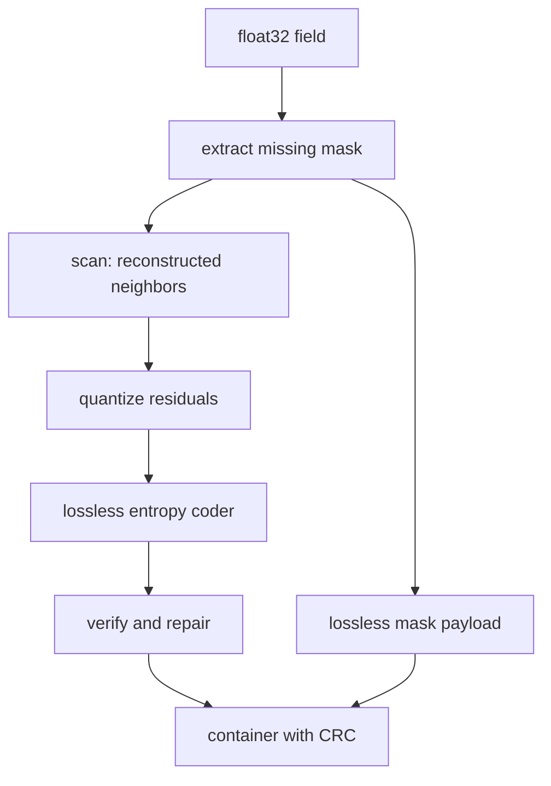

# BRACE Architecture

The codec is a deterministic, error-bounded `numcodecs.Codec` for gridded
floating-point data. It uses a reconstructed-neighbor spatial-temporal
predictor and a lossless entropy coder; it has no runtime model or external model
weights.

## Pipeline

The scan visits `(time, latitude, longitude)` in a fixed order. Each valid
cell is predicted from already reconstructed left, top, diagonal, and
temporal-parent cells. The longitude-local stencil is `(left 8, top 2,
top-left 1, top-right 1, temporal 1)`. At a cold start the predictor uses a
constant value of `32.0`, which is available identically to encode and decode.

The encoder simulates the decoder state while quantizing. Decode repeats the
same walk and therefore obtains the same prediction for every symbol. Rust
and Python implementations of the scan are kept bit-exact, with Python as
the fallback when the optional extension is unavailable.

## Guarantees

The quantization step is derived from the configured absolute error bound.
The verifier reconstructs the decoder result and emits exact repairs for any
outlier before the container is returned. Missing values are never predicted
or quantized: their RLE-or-bitpacked mask is stored separately and the
configured sentinel is restored exactly.

## Components

- `codec.py`: public API and encode/decode orchestration.
- `mask.py`: missing-value extraction and compact mask coding.
- `quant.py`: bound-derived residual lattice.
- `model/entropy.py`: lossless symbol coding.
- `verify.py`: post-encode bound verification and repair.
- `container.py`: versioned framing, optional outer compression, and CRC.
- `rust/brace_scan`: optional accelerated scan.
