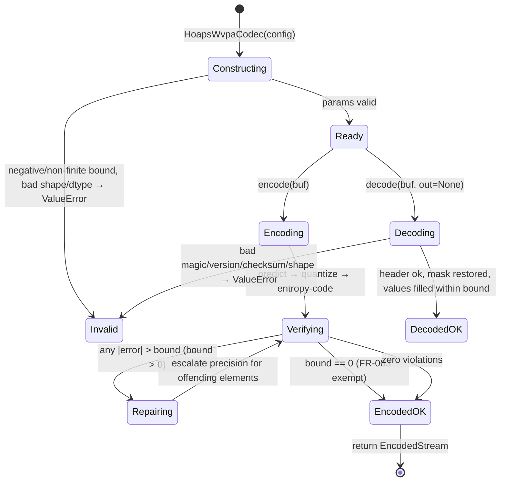

# Data Model: HOAPS WVPA Transformer Compressor

**Branch**: `001-hoaps-wvpa-compressor` | **Date**: 2026-09-14

Entities and data shapes for the compressor library. Types are given as Python/NumPy-level descriptions; the on-the-wire framing is specified in [contracts/codec-api.md](./contracts/codec-api.md).

## Entities

### 1. HoapsWvpaCodec

The public codec (numcodecs `Codec` subclass). Holds configuration; stateless across encode/decode calls other than cached model weights.

| Field | Type | Description |
|-------|------|-------------|
| `codec_id` (class attr) | `str` | `"hoaps-wvpa"` — registry key. |
| `error_bound` | `float` | Absolute error bound. MUST be ≥ 0 and finite; ≥ 0 enforced (negative/non-finite rejected at construction). `0.0` = tightest allowed bound (may still be lossy). |
| `shape` | `tuple[int, int, int]` | Grid shape `(time, lat, lon)` of the field. Fixed per codec instance; buffers of other sizes are rejected. |
| `missing_value` | `float` or `"nan"` | Sentinel identifying missing elements. `"nan"` denotes NaN-as-missing. |
| `dtype` | `str` | `"float32"` (fixed in v1). |

**Validation rules** (constructor; mirrors FR-008):
- `error_bound` must be a real, finite number ≥ 0; negative or non-finite → `ValueError`.
- `shape` must be a 3-tuple of positive integers.
- `missing_value` must be a finite float or the literal `"nan"`.
- `dtype` must be `"float32"` in v1.

**Relationships**: produces/consumes `EncodedStream`; uses `MissingMask`, `Quantizer`, `TransformerPredictor`, `EntropyCoder`, `Verifier`.

### 2. InputField / ReconstructedField

The decoded/encoded domain object viewed as a buffer.

| Field | Type | Description |
|-------|------|-------------|
| `values` | `np.ndarray(shape, dtype=float32)` | Gridded wvpa values; missing positions hold `missing_value` sentinel. |
| `shape` | `tuple` | Must equal codec config `shape`. |

**Rules**: input arrays MUST be C-contiguous, float32 (bit-cast view accepted for other float32-buffers of correct byte length), and of exactly `prod(shape)` elements — fully empty (zero-element) grids are out of scope. Reconstruction guarantees: for valid (non-missing) positions, `|recon − orig| ≤ error_bound` when bound > 0 (SC-001; bound=0 exempt per FR-003); for missing positions, sentinel value restored bit-exactly (SC-002).

### 3. MissingMask

| Field | Type | Description |
|-------|------|-------------|
| `bits` | `np.ndarray (bool[shape])` or packed bit array | `True` = missing. |
| `packed_size` | `int` | `ceil(prod(shape)/8)` bytes when bitpacked. |

**State transitions**: extracted at encode → packed losslessly into container payload → restored bit-exactly at decode. Never quantized or predicted. All-missing input → mask all-True and **no** value payload present. No valid values → codec produces valid, decompressible output (FR-009/FR-010).

### 4. QuantizedResiduals

Intermediate artifact (transient, not persisted standalone).

| Field | Type | Description |
|-------|------|-------------|
| `symbols` | integer array over valid positions | Signed indices into the quantum lattice for the residual `x − predictor(x)`. |
| `step` | `float` | Quantization step Δ ≤ `error_bound` used to derive lattice spacing; recorded in container metadata for decode. |
| `lattice_origin` | `float` | Grid offset used by the quantizer; recorded in metadata. |

**Rules**: chosen so that the *decoded* error including predictor error is within bound after repair: quantization alone bounds quantization error to Δ/2 per element; Predictor error is absorbed by the verify-and-repair loop (entity 5/6).

### 5. TransformerPredictor

Space-time transformer (attention over spatial patches across time steps, JPEG AI-inspired transform/attention blocks) predicting a value or residual from neighboring valid data.

| Field | Type | Description |
|-------|------|-------------|
| `weights` | versioned model parameters | Bundled with package; version recorded in container metadata (must match at decode). |
| `impl` | NVIDIA-free, CPU-first module | `src/hoaps_compressor/model/transformer.py`; CPU guarantee with optional GPU acceleration. |

**Rules**: deterministic for the recorded weights/versions; used at both encode and decode so predictor outputs agree bit-consistently on the same hardware paths. Weights incompatible with the recorded version → decode fails with clear error (stream ABI tied to model version).

### 6. RepairMap (verify-and-repair)

Per-element correction records for elements where reconstruction (as the decoder will see it) violates the bound.

| Field | Type | Description |
|-------|------|-------------|
| `positions` | indices into valid-value list | Elements needing correction. |
| `corrections` | exact/finer-quantum values or deltas | E.g., exact float32 correction, or a finer lattice symbol. |

**Invariants**: encoder runs the decode path, computes per-element error, and produces `RepairMap` until verification passes with zero violating elements; the loop terminates (each escalation strictly reduces residual uncertainty; worst case is exact correction per element, which trivially satisfies the bound).

### 7. EntropyCoder

| Field | Type | Description |
|-------|------|-------------|
| `mode` | per-block enum | e.g. `RAW` / `RANGE_CODED` / `PASSTHROUGH` |
| `block_size` | `int` | Fixed per container version. |

**Rules**: the coding stage MUST be bit-exact (lossless) so decode reproduces quantized symbols exactly — a prerequisite for the verify step computing the same errors the decoder will. Per-block mode chosen at encode to minimize encoded size (CR-maximizing knob, cf. FR-018).

### 8. EncodedStream (container)

Self-describing byte payload returned by `encode` / consumed by `decode`. Framing in [contracts/codec-api.md](./contracts/codec-api.md).

| Field | Type | Contents |
|-------|------|----------|
| `header` | fixed-layout bytes | Magic, version, model version, config digest, shape, dtype, sentinel descriptor, step/lattice params, payload lengths, checksum. |
| `mask_payload` | bitpacked bytes | Missing-value bitmask, `ceil(N/8)` bytes, stored losslessly. |
| `residual_payload` | entropy-coded bytes | Per-block modes + coded symbols + repair corrections (empty if all missing / no valid values). |
| `optional_compression` | bytes | Optional outer general-purpose compression of payloads (always lossless; e.g. DEFLATE-like), maximizing CR without touching guarantees. |

**Rules**: header checksum covers header + payloads; decode validates before reconstructing; version mismatches produce clear errors.

## State / Lifecycle

## Size Model (CR rationale)

- Original: `N = t·lat·lon` float32 = `4N` bytes.
- Compressed ≈ `ceil(N/8)` (mask) + entropy-coded residuals (≈ few bits/valid element in smooth regions, escalated only where needed) + fixed header.
- Smooth space-time correlation (spatial + temporal, FR-013) drives residual symbol entropy down; per-block mode selection (FR-018) and optional final lossless pass keep CR at the achievable maximum for the chosen bound (SC-003/SC-007).
